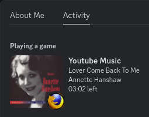

# Discord Rich Presence for Youtube Music activity

Concise Firefox web extension and Golang server for updating your Discord activity with songs playing on Youtube Music. Works on all operating systems.

## How to use

1. Download the source code
2. Go to `about:debugging` in FireFox 
3. Select `This Firefox` > `load Temporary Add-on` and select the directory containing the web extension (i.e [`extension`](./)
4. Ensure Discord application is started (not the browser version)
5. Ensure Golang version >= 1.22.5 is installed
6. Start the Golang server by building `go build ./gobackend/main.go` and running the executable (e.g: `./main` after building on Linux)
7. Go to `https://music.Youtube.com/*` and start any song
8. Your Discord rich presence should now be updated

## How it works

- Golang backend connects to Discord using IPC and listens on an end-point for active song metadata data.
- The web extension uses a `MutationObserver` to send updates to the server when the "pause-play" button changes
    (indicating a pause, seek-forward, seek-backward or a new song starting event)

## Considerations
- Why not connect to Discord directly through the Firefox extension?
    - (Firefox) extensions are sandboxed to increase safety in cases of malicious or malfunctioning code. This means they cannot freely access the Discord IPC socket
    located in the operating system filesystem.
    [read more about it here](https://wiki.mozilla.org/Security/Sandbox/Process_model#WebExtension_Process)

- Why not use [`mediaSession.setActionhandler()`](https://developer.mozilla.org/en-US/docs/Web/API/MediaSession/setActionHandler) instead of `MutationObserver`?
    - Using the `setActionHandler()` would be the *"proper"* way to implement an event based update model.
    However, on Firefox the required APIs (start, stop, etc) seemed to not be supported, (even if the [official documentation](https://developer.mozilla.org/en-US/docs/Web/API/MediaSession/setActionHandler#browser_compatibility) states elsewise?)

## Limitations and potential improvements
- Extension only sends an update if the Youtube Music browser is actively open
    - This happens due to browser optimizations; MutationObserver does not detect a change in HTML as the HTML is not actively changing
- Firefox extension requires permissions on `<all_urls>` (See [`manifest.json`](./manifest.json)).
    - Technically the extension only requires access to the server endpoint (e.g: http://127.0.0.1:8080/song-data), but the extension
    received a network error when `<all_urls>` was removed (not sure why?)
- Firefox extension has to be manually reloaded each time the browser is reset
    - This happens as the Extension is not available on the Firefox marketplace.
- Ads
    - Ads are currently not filtered when creating the rich presence, this is a nice issue to solve if anyone is interested.

## Motivation
This project was patched together to:
1. Orientate in Golang 
2. Better understand all technologies used
3. Create a simple Discord rich presence alternative for listening on Youtube Music
